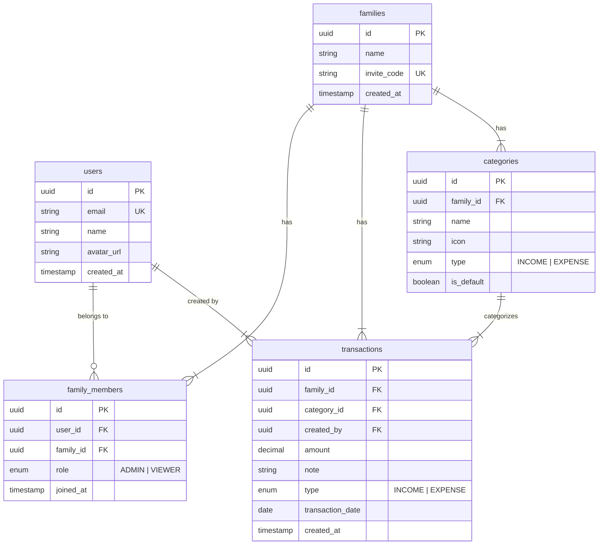

# FamFi - Family Finance App PRD

> **Project Name**: FamFi (Family Finance)  
> **Created**: 2025-12-11  
> **Version**: MVP 1.0 (Final)

## 1. Overview

FamFi is a family finance management application that allows couples to track income/expenses, categorize transactions, and view consolidated reports.

### 1.1 Goals
- Help families manage finances effectively
- Simple interface with quick data entry (chat-like input)
- Multi-tenant support (multiple families)

### 1.2 Target Users
- Husband/Wife: Admin role (full CRUD, invite members)
- Children: Viewer role (read-only)

---

## 2. Tech Stack

| Layer | Technology | Reason |
|-------|------------|--------|
| **Frontend** | Next.js 15 (App Router) | SSR, SEO, user experience |
| **UI Library** | shadcn/ui + Tailwind CSS | Modern, accessible, customizable |
| **Backend** | Node.js + Express + TypeScript | As requested |
| **Database** | Supabase (PostgreSQL) | Managed, realtime, free tier |
| **Auth** | Supabase Auth | Google OAuth + Email/Password |
| **Deployment** | Vercel (FE) + Railway/Render (BE) | Free tier friendly |

### 2.1 System Architecture

```
┌─────────────────┐     ┌─────────────────┐     ┌─────────────────┐
│   Next.js App   │────▶│  Node.js API    │────▶│    Supabase     │
│   (App Router)  │     │  (Express + TS) │     │   PostgreSQL    │
└─────────────────┘     └─────────────────┘     └─────────────────┘
        │                                               │
        └───────────── Supabase Auth ◀─────────────────┘
```

---

## 3. Database Schema



---

## 4. MVP Features

### 4.1 Authentication (Supabase Auth)
- [ ] Google Sign-in (required)
- [ ] Email/Password Sign-up & Sign-in
- [ ] Sign-out
- [ ] Basic profile (name, avatar)

### 4.2 Family Management
- [ ] Create new family → user becomes Admin
- [ ] Generate/Refresh invite code
- [ ] Join family via invite code
- [ ] View member list

### 4.3 Transaction Management
- [ ] Add transaction (income/expense) - full form
- [ ] **Quick Input** (chat-like): `"breakfast 50k"` → Auto parse
- [ ] View list + filters
- [ ] Edit/Delete (Admin only)

### 4.4 Categories
- [ ] Default categories (seed data)
- [ ] Custom category CRUD
- [ ] Icon picker

### 4.5 Dashboard & Reports
- [ ] Monthly income/expense summary
- [ ] Pie chart by category
- [ ] Bar chart comparing months
- [ ] Recent transactions

---

## 5. UI/UX Design - Minimalist Style

### 5.1 UI Library: **shadcn/ui + Tailwind CSS**
- Copy-paste components, no lock-in
- Built on Radix UI (accessible)
- Fits minimalist aesthetic

### 5.2 Design Inspiration
- **Dribbble**: [Minimal Finance App](https://dribbble.com/search/minimal-finance-app)
- **Mobbin**: [Finance Category](https://mobbin.com/browse/ios/apps?category=finance)
- References: Revolut, Wise, Monzo

### 5.3 Design Principles

| Principle | Implementation |
|-----------|----------------|
| **White space** | Generous padding |
| **Typography** | Inter/SF Pro |
| **Colors** | Neutral base + 1-2 accent |
| **Icons** | Line icons (Lucide) |
| **Charts** | Recharts |

### 5.4 Screens

```
├── 1. Landing Page
├── 2. Auth (Login/Register) 
├── 3. Onboarding (Create/Join Family)
├── 4. Dashboard
├── 5. Transactions (Quick Input + List)
├── 6. Reports
└── 7. Settings
```

---

## 6. Implementation Progress

| Task | Status |
|------|--------|
| Project Setup (Monorepo) | ✅ Done |
| Configure Supabase | ⏳ Pending |
| Authentication | ⏳ Pending |
| Family Management | ⏳ Pending |
| Transaction CRUD | ⏳ Pending |
| Quick Input Parser | ⏳ Pending |
| Categories | ⏳ Pending |
| Dashboard & Reports | ⏳ Pending |

---

## 7. Confirmed Decisions

| Decision | Choice |
|----------|--------|
| **Architecture** | ✅ Monorepo (apps/web + apps/api) |
| **Frontend** | ✅ Next.js 15 |
| **UI Style** | ✅ Minimalist |
| **UI Library** | ✅ shadcn/ui + Tailwind CSS |
| **Quick Input** | ✅ Flexible format |
