# FamFi - Technical Solution Document (TSD)

> **Version:** 1.0 MVP  
> **Last Updated:** 2025-12-12  
> **PRD Reference:** [PRD.md](./PRD.md)

---

## 1. System Overview

### 1.1 Architecture Diagram


### 1.2 Deployment Diagram


---

## 2. Database Schema

### 2.1 Entity Relationship Diagram


### 2.2 Table Definitions

```sql
-- Users (synced from auth.users via trigger)
CREATE TABLE public.users (
    id UUID PRIMARY KEY REFERENCES auth.users(id) ON DELETE CASCADE,
    email TEXT NOT NULL,
    full_name TEXT,
    avatar_url TEXT,
    created_at TIMESTAMPTZ DEFAULT NOW()
);

-- Families
CREATE TABLE families (
    id UUID PRIMARY KEY DEFAULT gen_random_uuid(),
    name TEXT NOT NULL,
    invite_code TEXT UNIQUE NOT NULL,
    created_at TIMESTAMPTZ DEFAULT NOW()
);

-- Family Members
CREATE TABLE family_members (
    id UUID PRIMARY KEY DEFAULT gen_random_uuid(),
    user_id UUID NOT NULL REFERENCES public.users(id) ON DELETE CASCADE,
    family_id UUID NOT NULL REFERENCES families(id) ON DELETE CASCADE,
    role TEXT NOT NULL CHECK (role IN ('ADMIN', 'VIEWER')),
    joined_at TIMESTAMPTZ DEFAULT NOW(),
    UNIQUE(user_id, family_id)
);

-- Categories
CREATE TABLE categories (
    id UUID PRIMARY KEY DEFAULT gen_random_uuid(),
    family_id UUID NOT NULL REFERENCES families(id) ON DELETE CASCADE,
    name TEXT NOT NULL,
    icon TEXT NOT NULL DEFAULT '📦',
    type TEXT NOT NULL CHECK (type IN ('INCOME', 'EXPENSE')),
    is_default BOOLEAN DEFAULT FALSE
);

-- Transactions
CREATE TABLE transactions (
    id UUID PRIMARY KEY DEFAULT gen_random_uuid(),
    family_id UUID NOT NULL REFERENCES families(id) ON DELETE CASCADE,
    category_id UUID REFERENCES categories(id) ON DELETE SET NULL,
    created_by UUID NOT NULL REFERENCES auth.users(id),
    amount DECIMAL(15,2) NOT NULL,
    note TEXT,
    type TEXT NOT NULL CHECK (type IN ('INCOME', 'EXPENSE')),
    transaction_date DATE NOT NULL DEFAULT CURRENT_DATE,
    created_at TIMESTAMPTZ DEFAULT NOW()
);
```

### 2.3 Row Level Security (RLS)

```sql
-- Enable RLS on all tables
ALTER TABLE public.users ENABLE ROW LEVEL SECURITY;
ALTER TABLE families ENABLE ROW LEVEL SECURITY;
ALTER TABLE family_members ENABLE ROW LEVEL SECURITY;
ALTER TABLE categories ENABLE ROW LEVEL SECURITY;
ALTER TABLE transactions ENABLE ROW LEVEL SECURITY;

-- Users: can only view/edit own profile
CREATE POLICY "Users can view own profile" ON public.users
    FOR SELECT USING (auth.uid() = id);

-- Transactions: family members can CRUD
CREATE POLICY "Family members can manage transactions" ON transactions
    FOR ALL USING (
        family_id IN (
            SELECT family_id FROM family_members WHERE user_id = auth.uid()
        )
    );
```

---

## 3. API Specification

### 3.1 Authentication Flow


### 3.2 API Response Format

```typescript
// Success Response
interface SuccessResponse<T> {
  success: true;
  data: T;
}

// Error Response
interface ErrorResponse {
  success: false;
  error: {
    code: string;
    message: string;
  };
}
```

### 3.3 Endpoint Details

#### POST /api/transactions/quick


---

## 4. Project Structure

```
famfi-v2/
├── apps/
│   ├── api/                    # Backend
│   │   ├── src/
│   │   │   ├── index.ts
│   │   │   ├── lib/
│   │   │   │   ├── supabase.ts
│   │   │   │   └── quickInput.ts
│   │   │   ├── middleware/
│   │   │   │   └── auth.ts
│   │   │   ├── routes/
│   │   │   ├── services/
│   │   │   └── database/
│   │   └── package.json
│   │
│   └── web/                    # Frontend
│       ├── src/
│       │   ├── app/            # Pages
│       │   ├── components/ui/  # shadcn
│       │   └── lib/supabase/
│       └── package.json
│
├── docs/
│   ├── PRD.md
│   └── TSD.md
├── Makefile
└── package.json
```

---

## 5. Quick Input Parser

### 5.1 Flow Diagram

```plantuml
@startuml Quick Input Parser
!theme plain

start
:Input: "coffee 50k";

partition "Pattern Matching" {
  :Try pattern 1:\n^(.+?)\\s+([\\d,.]+)(k|m|tr)?$;
  if (Match?) then (yes)
    :note = "coffee"\namount = "50"\nsuffix = "k";
  else (no)
    :Try pattern 2:\n^([\\d,.]+)(k|m|tr)?\\s+(.+)$;
    if (Match?) then (yes)
      :Extract parts;
    else (no)
      :Return null;
      stop
    endif
  endif
}

partition "Amount Calculation" {
  switch (suffix?)
  case (k)
    :amount × 1,000;
  case (m or tr)
    :amount × 1,000,000;
  case (none)
    :amount as-is;
  endswitch
}

partition "Type Detection" {
  :Check INCOME keywords;
  if (Match?) then (yes)
    :type = INCOME;
  else (no)
    :Check EXPENSE keywords;
    if (Match?) then (yes)
      :type = EXPENSE;
    else (no)
      :type = null;
    endif
  endif
}

:Return { amount, note, type };
stop

@enduml
```



### 5.2 Amount Suffix Multipliers

| Suffix | Multiplier | Example |
|--------|------------|---------|
| k | ×1,000 | 50k → 50,000 |
| m | ×1,000,000 | 10m → 10,000,000 |
| tr | ×1,000,000 | 2tr → 2,000,000 |

---

## 6. Security Implementation

### 6.1 Request Flow with Auth


---

## 7. Environment Variables

### 7.1 Backend (apps/api/.env)
```
PORT=3001
SUPABASE_URL=https://xxx.supabase.co
SUPABASE_PUBLISHABLE_KEY=eyJhbG...
SUPABASE_SECRET_KEY=eyJhbG...
```

### 7.2 Frontend (apps/web/.env.local)
```
NEXT_PUBLIC_SUPABASE_URL=https://xxx.supabase.co
NEXT_PUBLIC_SUPABASE_ANON_KEY=eyJhbG...
```

---

## 8. Error Handling

### 8.1 API Error Codes

| Code | Description |
|------|-------------|
| `UNAUTHORIZED` | Missing or invalid auth token |
| `NO_FAMILY` | User not in a family |
| `NOT_FOUND` | Resource not found |
| `INVALID_INPUT` | Validation failed |
| `PARSE_ERROR` | Quick input parse failed |
| `CREATE_ERROR` | Database insert failed |
| `UPDATE_ERROR` | Database update failed |
| `DELETE_ERROR` | Database delete failed |

---

## 9. Git Commit History

| # | Commit Message | Type |
|---|----------------|------|
| 1 | initial project setup | chore |
| 2 | configure Supabase database | feat |
| 3 | implement authentication | feat |
| 4 | add public.users table | fix |
| 5 | family management | feat |
| 6 | transaction CRUD | feat |
| 7 | auto-detect income/expense | feat |
| 8 | dashboard with charts | feat |
| 9 | category CRUD with icons | feat |
| 10 | reports with pie/bar charts | feat |
| 11 | polish with shadcn/ui | style |
| 12 | update category icons to emoji | fix |
| 13 | improve categories UX | style |
| 14 | integrate reports in dashboard | feat |
| 15 | fix date range queries | fix |
| 16 | auto-detect categories | feat |
| 17 | add Makefile | chore |
| 18 | add settings page | feat |
| 19 | add PRD | docs |
| 20 | add TSD | docs |

---

**Document Owner:** FamFi Engineering Team  
**Status:** Current as of MVP 1.0
